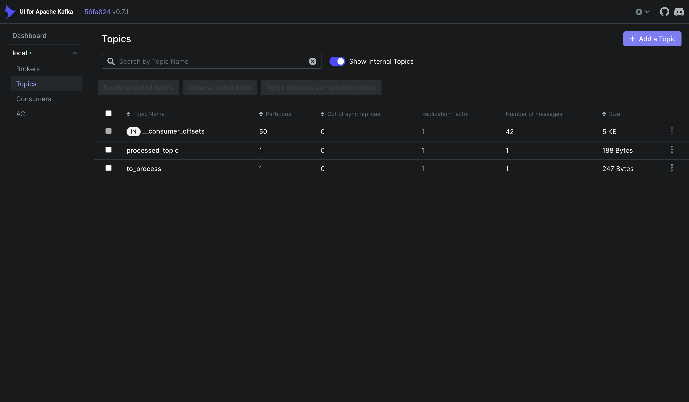
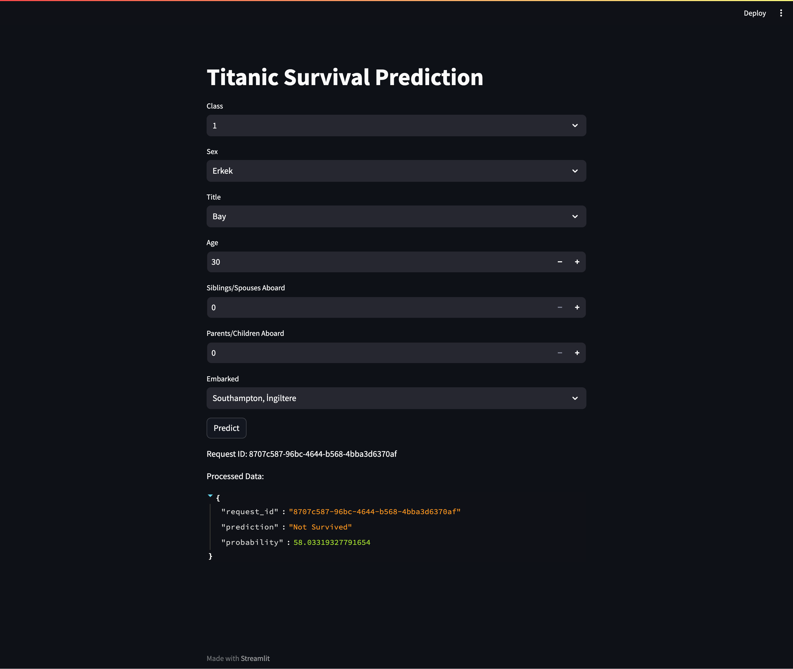
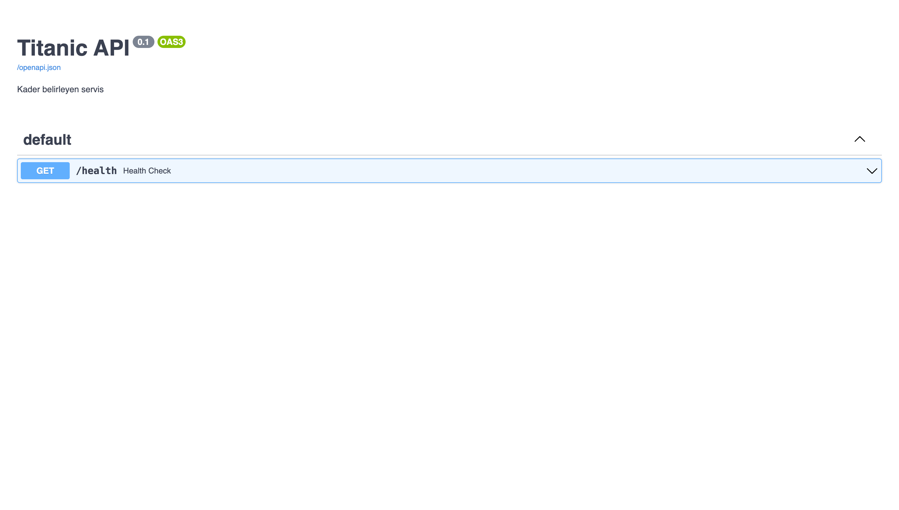

# GSÜ Kafka Kubernetes Example

## Overview
This repository provides an example implementation of a **microservices architecture** integrating **Streamlit**, **FastAPI**, and **Apache Kafka** for a predictive processing workflow. It demonstrates the use of Docker and Kubernetes for containerization and orchestration. The project is intended as an educational resource to introduce students to these technologies and their interactions.

## Key Components
1. **Streamlit (Front-End)**: 
   - Collects user inputs and displays results.
   - Sends user data to Kafka's `to_process` topic.
   
2. **Apache Kafka (Message Broker)**: 
   - Acts as an intermediary between front-end and back-end services.
   - Topics used: `to_process` (incoming data) and `processed` (results).
   
3. **FastAPI (Back-End)**: 
   - Consumes messages from Kafka's `to_process` topic.
   - Performs the prediction process and publishes results to `processed` topic.

4. **Consumer Script**:
   - A Python script that reads results from the `processed` topic.
   - Writes data into a JSON file for Streamlit to display.

5. **KafkaUI**: 
   - A web-based tool to monitor Kafka topics, producers, and consumers.

6. **Docker & Kubernetes**:
   - All components are containerized using Docker.
   - Kubernetes is used for orchestration and scaling of services.

## Architecture Diagram


## Prerequisites
- **Python 3.8+**
- **Docker** & **Docker Compose**
- **Kubernetes (Minikube or AWS EKS)**
- **AWS EC2 Instance** (Optional for cloud deployment)

## Setup Instructions

### 1. Local Development

#### Install Required Tools
```bash
# Install Docker and Git (if not already installed)
sudo apt-get update && sudo apt-get install docker git -y

# Start Docker service
sudo systemctl start docker

# Install Docker Compose
sudo curl -L https://github.com/docker/compose/releases/latest/download/docker-compose-$(uname -s)-$(uname -m) -o /usr/local/bin/docker-compose
sudo chmod +x /usr/local/bin/docker-compose
docker-compose --version
```

#### Run the Application Locally
1. Clone the repository:
   ```bash
   git clone <repository-url>
   cd <repository-directory>
   ```
2. Build and run services using Docker Compose:
   ```bash
   docker-compose up --build
   ```
3. Access the services:
   - **Streamlit**: `http://<public-ip>:8501`
   - **KafkaUI**: `http://<public-ip>:8080`

### 2. Kubernetes Deployment
1. Start Minikube or configure your Kubernetes cluster.
2. Apply the Kubernetes manifests:
   ```bash
   kubectl apply -f k8s/
   ```
3. Verify that all pods and services are running:
   ```bash
   kubectl get pods
   kubectl get services
   ```
4. Access the services via NodePort or LoadBalancer.

## Deployment on AWS EC2 (Optional)
- Launch a **t2.micro** instance with **1GB RAM, 1 vCPU**.
- Follow the Docker setup instructions above.
- Allow ports **8501** (Streamlit) and **8080** (KafkaUI) in the security group.

## Application Screenshots

- **KafkaUI**
  - 
- **Streamlit Interface**
  - 
- **FastAPI Endpoint**
  - 

## Notes
- This project is for **educational purposes** and does not represent a production-ready architecture.
- Modify and scale components as needed for real-world applications.

## Technologies Used
- **Streamlit**: Front-End
- **FastAPI**: Back-End
- **Apache Kafka**: Message Broker
- **Docker**: Containerization
- **Kubernetes**: Orchestration
- **KafkaUI**: Monitoring
- **AWS EC2**: Cloud Hosting (Optional)

## License
This project is released under the MIT License.